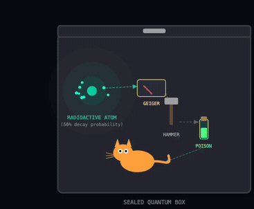
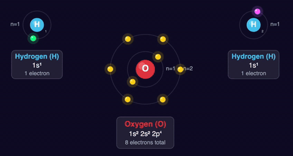
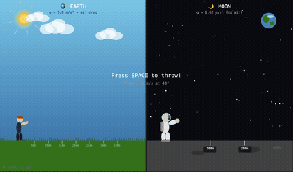
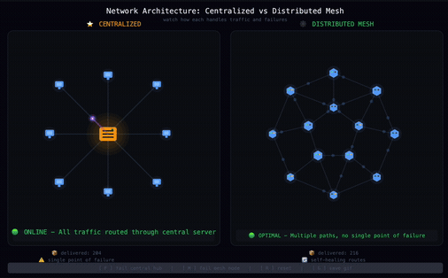

# salvador 

> _"Have no fear of perfection - you'll never reach it"<br/>
> -- Salvador Dalí_

**salvador** is an autonomous visualization agent for [Claude Code](https://code.claude.com/docs/en/overview)<br/>
&nbsp;&nbsp;&nbsp;&nbsp;&nbsp;&nbsp;&nbsp;&nbsp;&nbsp;&nbsp;&nbsp;&nbsp;&nbsp;&nbsp;&nbsp;&nbsp;
it lays down the path from thinking about the Universe to _looking_ at the Universe

* starts from a sketch
* inspects it with a headless browser
* critiques the aesthetics and UX
* and iteratively refines the result until the laws of physics hold and the visual matches the design principles

>  _$ /visualize schrödinger's cat_<br/>
>  

## how to play

### install it

clone the repository:

```bash
git clone https://github.com/tolitius/salvador.git
cd salvador
```

start the agent:

```bash
claude
```

*the Claude Code agent automatically detects the `.claude` configuration and loads the skill.*

### play

once `salvador` is in your `.claude/skills` path, start `claude` and visualize:

```bash
/visualize covalent bond H2O
```



or visualize the near cosmic forces:

```bash
/visualize the difference between throwing a basketball on Earth vs. on the Moon
```



or explain a concept:

```bash
/visualize the difference between a centralized network and a distributed mesh network
```



**salvador** will enter an autonomous loop: `coding` -> `inspecting` -> `refining`<br/>
when it is satisfied with the quality, it will launch the result in your browser

## structure

the skill organization follows the proposed [agent skills](https://agentskills.io/what-are-skills) convention:

```text
.
├── .claude/
│   ├── commands/
│   │   └── visualize.md       # slash command definition
│   ├── skills/
│   │   └── salvador/
│   │       ├── SKILL.md       # the brain: logic & constraints
│   │       ├── scripts/       # tooling: setup.sh, inspect.js
│   │       └── templates/     # scaffolding: index.html, main.js
│   └── settings.json          # permissions (auto-allows bash/edit)
└── CLAUDE.md                  # root agent context

```

## license

Copyright © 2026 tolitius

Distributed under the Eclipse Public License either version 1.0 or (at your option) any later version.
